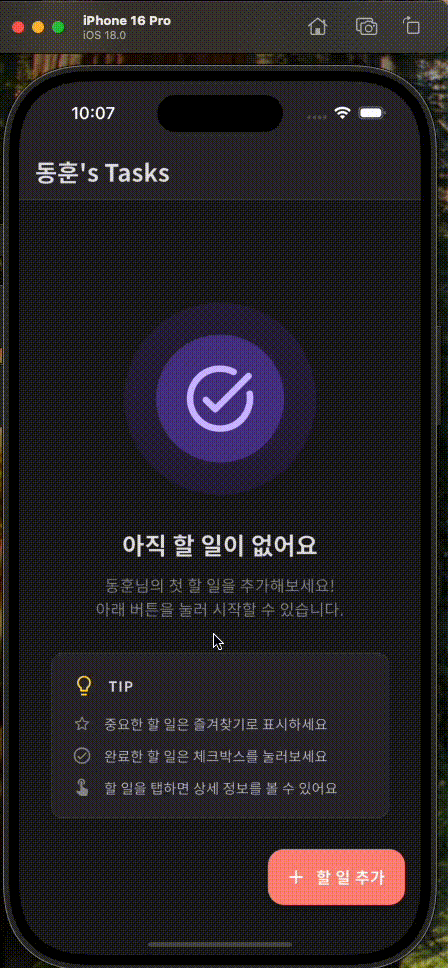

# Flutter Tasks App

> 세련된 UI와 다크 테마를 지원하는 현대적인 할 일 관리 애플리케이션

Flutter로 구현한 기능이 완전한 Todo 앱입니다. Material Design 3를 기반으로 한 아름다운 UI와 라이트/다크 테마 자동 전환을 지원합니다.

## 📱 앱 데모

<div align="center">

### 🎬 실제 동작 화면

<table>
  <tr>
    <td align="center">
      
      <br/>
      <sub><b>☀️ 라이트 테마</b></sub>
    </td>
    <td align="center">
      
      <br/>
      <sub><b>🌙 다크 테마</b></sub>
    </td>
  </tr>
</table>

*할 일 추가/삭제, 즐겨찾기, 스와이프 삭제 등 모든 기능을 확인하세요*

---

</div>

## ✨ 주요 기능

### 핵심 기능
- ✅ **할 일 추가** - 제목과 세부 정보를 포함한 할 일 생성
- 🗑️ **스와이프로 삭제** - 왼쪽으로 스와이프하여 직관적으로 삭제
- ↩️ **실행 취소** - 삭제 후 4초 내 복구 가능
- ✔️ **완료 표시** - 체크박스 클릭으로 완료/미완료 토글
- ⭐ **즐겨찾기** - 중요한 할 일을 별표로 강조
- 📝 **상세 보기** - 할 일의 전체 정보 확인

### UI/UX 특징
- 🎨 **Material Design 3** - 현대적이고 세련된 디자인
- 🌓 **다크 테마** - 시스템 설정에 따라 자동 전환
- 💫 **부드러운 애니메이션** - InkWell, Dismissible 등 네이티브 애니메이션
- 📱 **반응형 디자인** - 모든 화면 크기 지원
- 🇰🇷 **한글 지원** - Noto Sans KR 폰트 적용

## 🎨 디자인 시스템

### 색상 팔레트

#### 라이트 테마
- Primary: Purple (#6750A4)
- Accent: Soft Red (#FF6B6B)
- Success: Green (#4CAF50)
- Background: Light Grey (#F5F5F7)
- Surface: White (#FFFFFF)

#### 다크 테마
- Primary: Light Purple (#D0BCFF)
- Accent: Bright Red (#FF8A80)
- Success: Light Green (#81C784)
- Background: Dark Grey (#1C1B1F)
- Surface: Dark Purple (#2B2930)

### 주요 UI 컴포넌트
- **TodoView Card** - 즐겨찾기는 노란색 배경으로 강조
- **Custom Checkbox** - 원형, 채워진 녹색 디자인
- **Bottom Sheet** - 세련된 입력 폼
- **Empty State** - 사용자 친화적인 가이드
- **Extended FAB** - 텍스트가 있는 플로팅 버튼

## 🛠️ 기술 스택

- **Flutter** - UI 프레임워크
- **Dart** - 프로그래밍 언어
- **Material Design 3** - 디자인 시스템

## 📁 프로젝트 구조

```
lib/
├── main.dart                           # 앱 진입점
├── core/                              # 핵심 설정
│   ├── constants/
│   │   └── app_constants.dart         # 색상, 간격, 폰트 크기 등 상수
│   └── theme/
│       └── app_theme.dart             # 라이트/다크 테마 정의
├── models/
│   └── todo_entity.dart               # 할 일 데이터 모델 (불변)
├── pages/
│   ├── home/
│   │   └── home_page.dart             # 메인 화면
│   └── todo_detail/
│       └── todo_detail_page.dart      # 상세 화면
└── widgets/
    ├── common/
    │   ├── add_action_button.dart     # FAB 위젯
    │   └── empty_task_view.dart       # 빈 상태 화면
    └── todo/
        ├── add_task_bottom_sheet.dart # 할 일 추가 폼
        └── todo_view.dart             # 할 일 아이템 카드
```

## 🚀 시작하기

### 요구사항
- Flutter SDK 3.0 이상
- Dart 3.0 이상

### 설치 및 실행

```bash
# 1. 의존성 설치
flutter pub get

# 2. 앱 실행
flutter run

# 3. 특정 디바이스에서 실행
flutter run -d <device_id>
```

### 빌드

```bash
# Android APK
flutter build apk

# iOS (macOS에서만)
flutter build ios

# 빌드 캐시 정리
flutter clean
```

## 🏗️ 아키텍처

### 상태 관리 패턴
- **StatefulWidget 기반** - 간단하고 명확한 로컬 상태 관리
- **Callback 패턴** - 부모-자식 간 데이터 흐름 관리
- **Immutable Data Model** - copyWith 패턴으로 불변성 보장

### 데이터 흐름
```
HomePage (데이터 소유)
    ↓ (데이터 전달)
TodoView (UI 렌더링)
    ↑ (이벤트 콜백)
HomePage (상태 업데이트)
```

### 주요 디자인 패턴
- **Single Responsibility Principle** - 각 위젯은 하나의 책임만
- **Composition over Inheritance** - 위젯 조합 우선
- **Immutability** - 불변 데이터 모델
- **Context-aware Colors** - 테마에 따라 색상 자동 변경

## 🎯 주요 특징

### 1. 불변 데이터 모델
```dart
class TodoEntity {
  final String title;
  final bool isFavorite;

  TodoEntity copyWith({
    String? title,
    bool? isFavorite,
  }) { ... }
}
```

### 2. Context-aware 색상 시스템
```dart
// 테마에 따라 자동으로 색상 변경
AppColors.primary(context)  // 라이트: #6750A4, 다크: #D0BCFF
```

### 3. 스와이프로 삭제 + Undo
```dart
Dismissible(
  onDismissed: () => deleteTodo(),
  background: RedBackground(),
)

// Snackbar로 실행 취소 옵션 제공
```

### 4. 상세 페이지 상태 동기화
- DetailPage에서 즐겨찾기 변경 시 HomePage 자동 반영
- Navigator를 통한 양방향 데이터 전달

## 📱 화면 구성

### 1. 메인 화면 (HomePage)
- 할 일 목록 표시 (ListView.builder)
- 빈 상태 시 가이드 표시
- Extended FAB로 할 일 추가

### 2. 상세 화면 (TodoDetailPage)
- 할 일 제목 및 설명 표시
- 즐겨찾기 토글
- 상태 칩 (완료됨/진행 중, 즐겨찾기)

### 3. 추가 폼 (AddTaskBottomSheet)
- 제목 입력 (필수)
- 세부 정보 입력 (선택)
- 즐겨찾기 토글
- 실시간 유효성 검사

## 🧪 코드 품질

### 정적 분석
```bash
flutter analyze
# No issues found! ✅
```

### 주요 준수 사항
- ✅ Flutter 코딩 컨벤션
- ✅ Material Design 가이드라인
- ✅ Immutability 원칙
- ✅ 명확한 네이밍
- ✅ 주석 및 문서화

## 📝 라이선스

This project is for educational purposes.